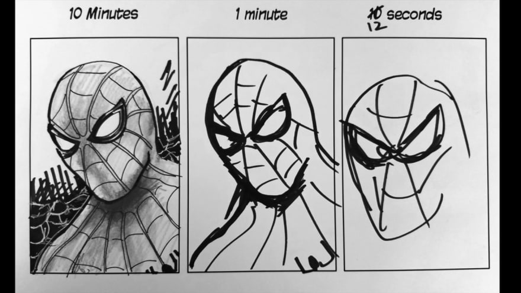

 # Estimations

- +30% for writing tests
- +20% for organisation, communication, coordination, writing issues, moving them around, meetings etc
- +25% for writing documentation
- +10% Merge Request and Peer Review
- +15% tolerance buffer for wrong estimations

Amount of involvement | Additional Time
------------ | -------------
I do all the work | +0%
I work, you watch | +10%
I work, you advice | +20%
I work, you help | +50%
I work, you tell how | +60%

### Example

How long will implementing filters for a search-results-page take?

I'm thinking of the best case, where everything is specified neatly,
the design is there.

API is well known etc. ` 10 days ( 80 hrs ) `

*Now I'll start adding additional time*

1. Do I know the codebase? If not, I add ` 2 days. ( +12 hrs ) `
2. How well is the design specified? Oh, only the desktop-view?      
` add 3 days. ( +15 hrs ) `

3. Is the REST-API known and documented? 
Ah it's being currently made and is quite new?
`add 3 days ( + 18 hrs )`

4. Is the local instance of the shop running reliably on my dev-machine? 
This projects is based on SAP-Hybris, 
so for initializations, updates, local fuckups etc I `add 3 days ( +21 hrs )`

5. How well are the requirements written?
Don't get me started, for additional client-communication `add 2 days ( +23 hrs )`

This goes on an in the end I arrive at 25 days,
which, telling from experience, is a totally OK amount of time 
to spend on such a feature.

**But do you really need five weeks for this? No, I'll most likely be done in half the time, BUT:**

- I'm highly allergic to stress
- It's not a prophecy, it's a forecast (as in weather)
